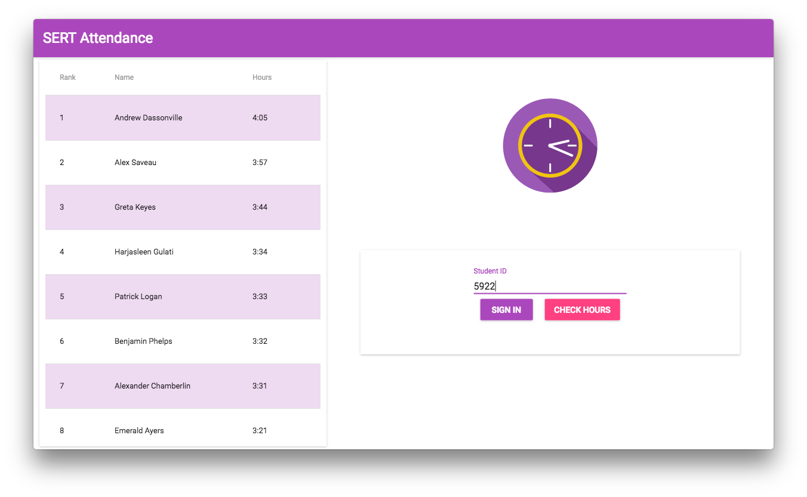
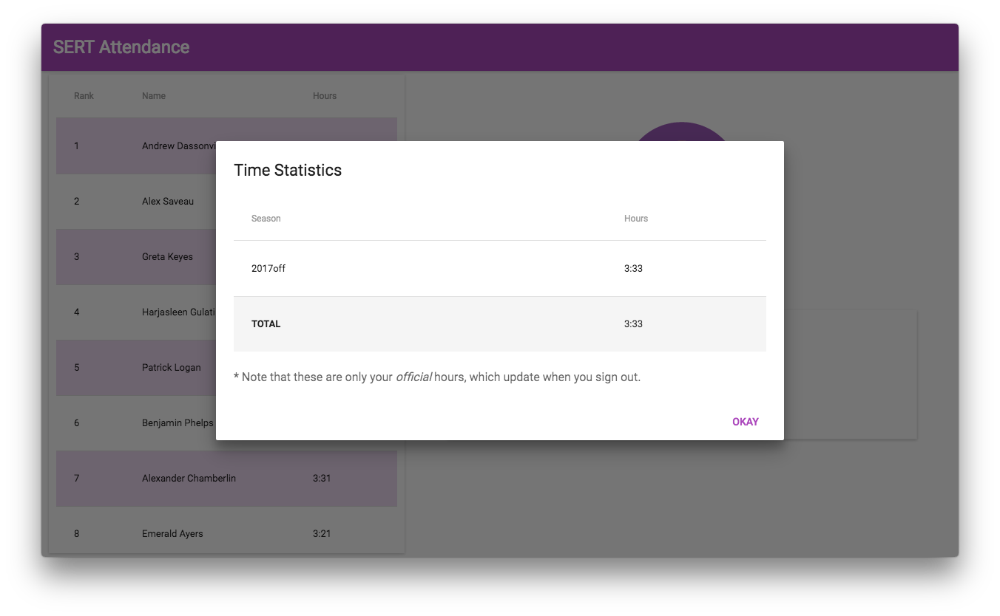

# Attendance Client

[![Release][release-img]][release-url]
[![Build][travis-img]][travis-url]

This is a user interface for SERT's attendance. It allows users to sign in,
sign out, check their hours, and compete against others with a live-updating
leaderboard.

## Screenshots




## Building

Install the dependencies with:

```bash
$ npm install
```

Then you'll be able to run the dev server and up an Electron instance with:

```bash
$ npm run dev
```

To build and output executables, execute the `release:<os>` npm script. For
example,

```bash
$ npm run release:windows      # Release for Windows
$ npm run release:mac          # Release for Mac
$ npm run release:linux        # Release for Linux
```

<!-- Badge URLs -->

[release-img]: https://img.shields.io/github/release/FRCTools/Attendance-Client.svg?style=flat-square
[release-url]: https://github.com/FRCTools/Attendance-Client/releases
[travis-img]:  https://img.shields.io/travis/FRCTools/Attendance-Client.svg?style=flat-square
[travis-url]:  https://travis-ci.org/FRCTools/Attendance-Client
